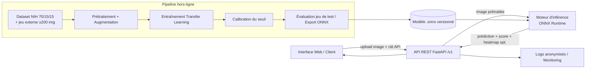

# Cahier des charges — Version 3.1 (optimisée)

## Système de détection automatique du paludisme par imagerie de cellules sanguines

**Intègre et corrige la V3.0 — prête pour développement sans clarification préalable**

> **Changelog V3.0 → V3.1** : format d'export unifié (ONNX), cadre légal aligné sur la Côte d'Ivoire (Loi n° 2013-450 / ARTCI) + accord éthique, contrat API désambiguïsé (`confidence`), planning en pistes parallèles (17 → \~12 j), infra conteneur précisée, option d'explicabilité (Grad-CAM), versioning modèle et API.

---

# 1. Synthèse du projet

## 1.1 Contexte

Le paludisme reste endémique en Côte d'Ivoire. Le diagnostic de référence — l'examen microscopique manuel de frottis sanguins — est fiable mais lent, dépendant de l'expertise de l'observateur et sujet à la fatigue, ce qui limite le débit de diagnostic en zone à forte prévalence.

## 1.2 Problème adressé

Automatiser la classification binaire de cellules sanguines (parasitées / saines) à partir d'images microscopiques, avec un système **complet et déployable** : modèle de deep learning (transfer learning), API d'inférence et interface de démonstration.

## 1.3 Objectifs mesurables (critères de succès)

| Indicateur | Cible | Mesure |
| --- | --- | --- |
| Accuracy | ≥ 95 % | Jeu de test indépendant |
| AUC | ≥ 0.97 | Jeu de test |
| Rappel (sensibilité) | ≥ 96 % | Jeu de test — **métrique prioritaire** |
| Latence API | \< 500 ms P95 | CPU 4 cœurs / 8 Go RAM, validé par test de charge |
| Taille du modèle | \< 20 Mo | Artefact ONNX exporté, quantifié si nécessaire |
| Disponibilité API | ≥ 99 % | Environnement de démonstration |

## 1.4 Cibles et utilisateurs

- **Utilisateur final visé** : techniciens de laboratoire / personnel de santé — outil d'**aide à la décision**, non un dispositif de diagnostic certifié.
- **Lecteurs techniques** : équipes Data / ML / Backend / Frontend / QA.
- **Portée V1** : classification binaire d'images de cellules uniques, démonstration uniquement. Production gelée jusqu'à validation clinique + jeu de test externe. Frottis complets, mobile natif et multi-espèces restent hors périmètre.

## 1.5 Parties prenantes

| Rôle | Responsabilité |
| --- | --- |
| Chef de projet / Product Owner | Priorisation, validation des livrables |
| Data Engineer | Pipeline de données, prétraitement |
| ML Engineer | Entraînement, évaluation, optimisation |
| Backend Developer | API d'inférence, intégration |
| Frontend Developer | Interface de démonstration |
| QA / Testeur | Plan de tests, validation, test de charge |

---

# 2. Spécifications fonctionnelles (par module)

## Module A — Pipeline de données (offline)

| ID | Exigence | Priorité |
| --- | --- | --- |
| A1 | Script unique `download_data.py` récupérant le dataset NIH (\~27 500 images, 2 classes équilibrées) | Must |
| A2 | Prétraitement : redimensionnement 128×128, normalisation \[0,1\] | Must |
| A3 | Augmentation : rotation ±20°, translation 10 %, zoom 15 %, flip horizontal | Must |
| A4 | Split stratifié 70 % / 15 % / 15 % (train / validation / test), reproductible (seed fixé). Le jeu de test n'est **jamais** utilisé pendant l'entraînement ni pour le early stopping | Must |
| A5 | Dataset non versionné dans Git | Must |
| A6 | Constitution d'un **jeu d'évaluation externe** d'au moins **200 images étiquetées**, issu d'un laboratoire partenaire, dès le Sprint 1, pour mesurer la généralisation réelle | Must |
| A7 | **Accord préalable du laboratoire partenaire / comité d'éthique** avant toute collecte ou usage d'images de patients réels, avec anonymisation à la source (aucune métadonnée patient dans le fichier image) | Must |

## Module B — Entraînement du modèle (offline)

| ID | Exigence | Priorité |
| --- | --- | --- |
| B1 | Entraînement reproductible via un script unique (`train.py`) | Must |
| B2 | Transfer learning MobileNetV2 (ImageNet), deux phases : feature extraction (lr 1e-4, \~15 epochs) puis fine-tuning des 30 dernières couches (lr 1e-5, \~10 epochs) | Must |
| B3 | Régularisation : Dropout 0.3, early stopping (sur le jeu de validation uniquement) | Must |
| B4 | Suivi des métriques : loss, accuracy, AUC, rappel, matrice de confusion | Must |
| B5 | Export au **format ONNX** (runtime `onnxruntime`, indépendant de TensorFlow, \~2-3× plus rapide sur CPU) ; si l'artefact dépasse 20 Mo, appliquer une **quantification int8** via `onnxruntime.quantization` | Must |
| B6 | **Calibration du seuil de décision** sur la courbe PR/ROC du jeu de validation (cible : rappel ≥ 98 % avec précision maximale), documentée, exposée via `DECISION_THRESHOLD` | Must |
| B7 | Les métriques finales d'acceptation sont mesurées **sur le jeu de test** avec le seuil calibré | Must |
| B8 | **Versioning du modèle** au format sémantique (`model_version = "1.0.0"`), incrémenté à chaque réentraînement significatif ; chaque version associée à son propre `metrics_baseline.json` | Must |
| B9 | Encodage de classe **documenté explicitement** dans `config.yaml` (ex. `class_map: {0: "Parasitized", 1: "Uninfected"}`) et utilisé identiquement à l'entraînement et à l'inférence pour éviter toute inversion silencieuse | Must |

## Module C — API d'inférence (online)

| ID | Exigence | Priorité |
| --- | --- | --- |
| C1 | `POST /v1/predict` : image unique (PNG/JPEG, max 5 Mo) → voir contrat détaillé en 3.3 | Must |
| C2 | `POST /v1/predict/batch` : max 32 images par requête ; en cas d'échec partiel, retourner les résultats réussis + une liste d'erreurs nommée par fichier | Should |
| C3 | `GET /health` : `{status, model_version, decision_threshold, class_map}` | Must |
| C4 | Rejet explicite des fichiers non conformes (400 format/corruption, 413 taille, 500 erreur interne) | Must |
| C5 | Logging de chaque prédiction (horodatage, résultat, score) **anonymisé** (aucun identifiant patient, aucune image conservée) | Must |
| C6 | Architecture stateless (scaling horizontal) | Must |
| C7 | Authentification par clé API (`X-API-Key`), obligatoire hors réseau local ; **rate limiting explicite : 60 requêtes/minute par clé** (implémentation : `slowapi`) | Must |
| C8 | Préfixe de version dans l'URL (`/v1/...`) pour permettre une évolution du contrat sans rupture rétroactive | Should |
| C9 | (Option, forte valeur démo) `include_heatmap=true` en paramètre optionnel de `/v1/predict` : retourne une image Grad-CAM encodée en base64 localisant la zone ayant motivé la décision | Could |

## Module D — Interface de démonstration

| ID | Exigence | Priorité |
| --- | --- | --- |
| D1 | Upload d'une image via une page web, affichage du résultat sans ligne de commande | Should |
| D2 | Affichage clair : classe prédite + score de confiance, avec libellé précisant explicitement à quelle classe le score se rapporte | Should |
| D3 | Messages d'erreur compréhensibles pour fichiers invalides | Should |
| D4 | Interface **HTML/JS simple en V1** (délai contraint) ; migration React envisagée en V2 si besoin | Should |
| D5 | Affichage du statut « outil d'aide à la décision — ne remplace pas un diagnostic médical certifié » sur toutes les pages | Must |
| D6 | Si Grad-CAM activé côté API (C9), superposition visuelle de la carte de chaleur sur l'image uploadée | Could |

## Module E — Qualité, suivi et déploiement

| ID | Exigence | Priorité |
| --- | --- | --- |
| E1 | Suite de tests : unitaires (prétraitement, modèle), intégration API, non-régression du modèle | Must |
| E2 | Couverture de tests ≥ 70 % sur le code métier | Must |
| E3 | Test de charge obligatoire (Locust) validant le SLO 500 ms P95 en conditions représentatives | Must |
| E4 | `metrics_baseline.json` versionné par version de modèle (B8) : accuracy ≥ 0.95, rappel ≥ 0.96, AUC ≥ 0.97, tolérance -0.5 pt max | Must |
| E5 | Plan de dérive du modèle opérationnel : audit mensuel sur un échantillon étiqueté (interne + externe), alerte si rappel \< 94 %, processus de réentraînement documenté | Must |
| E6 | Conteneurisation Docker (API + modèle), configuration par variables d'environnement, **limites de ressources définies** (2 vCPU / 2 Go RAM par instance), probes `liveness`/`readiness` sur `/health` | Must |
| E7 | Documentation (README) permettant reproduction de l'entraînement, de la calibration et du déploiement sans support | Must |
| E8 | Suivi d'expériences : logs CSV en V1 (zéro infrastructure) ; migration MLflow si plusieurs expérimentateurs | Should |

---

# 3. Spécifications techniques

## 3.1 Architecture



## 3.2 Modèle de deep learning

- **Backbone** : MobileNetV2 pré-entraîné ImageNet — léger, rapide en inférence CPU, compatible cible \< 20 Mo.
- **Tête de classification** : GlobalAveragePooling2D → Dense(128, relu) → Dropout(0.3) → Dense(1, sigmoid).
- **Entrée** : 128×128×3, normalisation \[0,1\] identique entre entraînement et inférence (code de prétraitement partagé, testé en non-régression).
- **Encodage de classe** : figé dans `config.yaml`, jamais recalculé implicitement (B9) — élimine le risque d'inversion Parasitized/Uninfected.
- **Décision** : seuil calibré sur la courbe PR du jeu de validation (favorisant le rappel, ex. rappel ≥ 98 %), exposé via `DECISION_THRESHOLD` ; jamais 0.5 par défaut sans calibration.
- **Export** : entraînement en Keras → export **ONNX** (`tf2onnx`) pour l'inférence ; quantification int8 (`onnxruntime.quantization`) si l'artefact dépasse 20 Mo.
- **Explicabilité (optionnelle, C9/D6)** : Grad-CAM calculé sur la dernière couche convolutive du backbone avant export, généré à la demande côté inférence.

## 3.3 Contrat d'API détaillé

**`POST /v1/predict`**

```
Requête  : multipart/form-data — file (image, max 5 Mo), include_heatmap (bool, optionnel)
Réponse  : 200 OK
{
  "prediction": "Parasitized",
  "confidence": 0.9421,          // probabilité associée à la classe prédite ("prediction"), pas à une classe fixe
  "probability_parasitized": 0.9421,  // explicite, sans ambiguïté, quelle que soit la classe prédite
  "model_version": "1.0.0",
  "processing_time_ms": 187,
  "heatmap_base64": null          // rempli seulement si include_heatmap=true
}
```

Le doublon `confidence` / `probability_parasitized` supprime toute ambiguïté d'interprétation côté client, quel que soit l'ordre d'encodage interne des classes.

**`GET /health`**

```
{ "status": "ok", "model_version": "1.0.0", "decision_threshold": 0.62,
  "class_map": {"0": "Parasitized", "1": "Uninfected"} }
```

## 3.4 Stack technique

| Composant | Technologie |
| --- | --- |
| Langage | Python 3.10+ |
| Deep Learning (entraînement) | TensorFlow 2.x / Keras |
| Inférence | ONNX Runtime |
| API | FastAPI + Uvicorn |
| Validation | Pydantic |
| Tests | Pytest + Locust (charge, obligatoire) |
| Rate limiting | slowapi |
| Conteneurisation | Docker / docker-compose |
| Interface démo | HTML/JS simple (V1) — React en évolution |
| Suivi d'expériences | Logs CSV (V1) — MLflow optionnel |
| Sécurité API | Clé API (`X-API-Key`) + rate limiting |

## 3.5 Arborescence du projet

```
malaria-detection/
├── .github/workflows/ci-cd.yml     # Tests + build Docker à chaque push
├── config/
│   ├── config.yaml                 # Hyperparamètres, class_map, DECISION_THRESHOLD
│   └── logging.json                # Format de logs JSON structurés
├── data/
│   ├── raw.dvc                     # Pointeur DVC vers les données brutes
│   └── processed/                  # Splits train/val/test + jeu externe
├── src/
│   ├── data/
│   │   ├── download.py
│   │   └── preprocessing.py        # Transformation + contrôle qualité image (IQA)
│   ├── models/
│   │   ├── train.py
│   │   ├── evaluate.py             # Métriques sur jeu de test
│   │   ├── calibrate_threshold.py
│   │   ├── explain.py              # Grad-CAM (optionnel)
│   │   └── export.py               # Export ONNX + quantification
│   ├── api/
│   │   ├── main.py
│   │   ├── dependencies.py         # Auth clé API, rate limit, chargement modèle
│   │   ├── routes/                 # /v1/predict, /v1/predict/batch, /health
│   │   └── schemas.py
│   └── utils/logger.py
├── tests/
│   ├── unit/ integration/ load/ model/
├── metrics_baseline/                # Un fichier JSON par model_version
├── models/model_v1.0.0.onnx         # Versionné hors Git
├── web_app/                         # Frontend HTML/JS
├── notebooks/
├── Dockerfile
├── docker-compose.yml
├── requirements.txt
└── README.md
```

## 3.6 Déploiement

- Image Docker unique (API + modèle) ; variables d'environnement : `MODEL_PATH`, `MODEL_VERSION`, `DECISION_THRESHOLD`, `PORT`, `LOG_LEVEL`, `API_KEY`, `RATE_LIMIT`.
- **Limites de ressources par conteneur** : 2 vCPU / 2 Go RAM ; probes `liveness` (process actif) et `readiness` (modèle chargé) sur `/health`.
- Environnements : `dev` (local), `staging` (démonstration). Pas de `prod` en V1 (gelé jusqu'à validation clinique + jeu de test externe).
- CI/CD : tests (dont non-régression) à chaque push, build Docker sur la branche principale, secrets (clé API, registre Docker) gérés via secrets CI — jamais en clair dans le dépôt.

## 3.7 Jalons — planning en pistes parallèles

Le découpage V3.0 était entièrement séquentiel (17 j). En organisant le travail par pistes parallèles dès que les dépendances le permettent, le chemin critique se réduit :

| Sprint | Piste Data/ML | Piste Backend/Frontend | Piste QA/Infra |
| --- | --- | --- | --- |
| 0 (2 j) | — | Setup dépôt, Dockerfile, arbitrages figés | CI de base |
| 1 (3 j) | Pipeline de données + jeu externe (A1-A7) | Contrat d'API figé (3.3) + mock server, maquette interface | Prépare l'infra de test de charge |
| 2 (4 j) | Entraînement + fine-tuning + calibration (B1-B9) | Développement API contre le mock, développement interface | Prépare les jeux de tests d'intégration |
| 3 (3 j) | Export ONNX, intégration modèle réel dans l'API | Branchement API ↔ modèle réel, clé API, logs | Tests d'intégration réels |
| 4 (2 j) | — | Finalisation interface (Grad-CAM si retenu) | Test de charge Locust, couverture ≥ 70 % |
| 5 (2 j) | — | — | Documentation, packaging, plan de dérive |

**Total estimé : \~13-14 jours** (contre 17 en séquentiel), grâce au découplage Backend/Frontend du modèle réel via un contrat d'API figé dès le Sprint 1.

---

# 4. Exigences non fonctionnelles

| Dimension | Exigence |
| --- | --- |
| **Performance** | Inférence \< 500 ms/image sur CPU standard, validée par test de charge ; batch (≤ 32 images) sans dégradation proportionnelle |
| **Portabilité** | Conteneurisation Docker, déploiement reproductible, ressources bornées (3.6) |
| **Sécurité** | Validation stricte des uploads, authentification par clé API, rate limiting chiffré (60 req/min), secrets hors dépôt |
| **Confidentialité & conformité** | Conforme à la **Loi ivoirienne n° 2013-450** relative à la protection des données à caractère personnel (autorité : **ARTCI**) ; aucune image conservée au-delà de la session ; logs anonymisés, rétention 12 mois avec purge automatique ; **accord éthique / consentement du laboratoire partenaire obligatoire** avant tout usage d'images réelles de patients (A7) |
| **UX/UI** | Interface minimaliste, résultat lisible, avertissement médical visible partout |
| **Maintenabilité** | Couverture ≥ 70 %, code modulaire, prétraitement unique partagé, class_map et seuil centralisés en config |
| **Observabilité** | Logs structurés, métriques exposées (latence, taux d'erreur, version du modèle, seuil) |
| **Fiabilité modèle** | Audit mensuel de dérive, alerte si rappel \< 94 %, réentraînement documenté et versionné (B8) |
| **Conformité médicale** | Statut d'aide à la décision affiché partout ; V1 limitée à la démonstration |

---

# 5. Décisions tranchées et traçabilité

## 5.1 Arbitrages

| # | Point | Décision |
| --- | --- | --- |
| 1 | Interface React ou HTML/JS | HTML/JS simple en V1, React en évolution |
| 2 | MLflow ou logs CSV | Logs CSV en V1, MLflow si plusieurs expérimentateurs |
| 3 | Test de charge | Obligatoire (SLO 500 ms P95 = critère d'acceptation) |
| 4 | Environnement `prod` | Gelé : V1 = démonstration uniquement |
| 5 | Format d'export du modèle | **ONNX** (retenu au lieu de .keras/TFLite — cohérence corrigée en V3.1) |
| 6 | Cadre légal | **Loi ivoirienne n° 2013-450 / ARTCI** (corrigé en V3.1, au lieu d'une référence RGPD implicite) |
| 7 | Ambiguïté du champ `confidence` | Résolue par l'ajout de `probability_parasitized` (V3.1) |
| 8 | Explicabilité (Grad-CAM) | Ajoutée en option (Could) pour renforcer la valeur de démonstration |

## 5.2 Critères d'acceptation

- [ ] Accuracy ≥ 95 %, AUC ≥ 0.97, Rappel ≥ 96 % **sur le jeu de test**, seuil calibré
- [ ] Artefact ONNX exporté \< 20 Mo (quantifié si nécessaire)
- [ ] API répond en moins de 500 ms P95, validé par test de charge Locust
- [ ] Tests de non-régression basés sur `metrics_baseline/<model_version>.json`
- [ ] Couverture de tests ≥ 70 % sur le code métier
- [ ] Image Docker démarre, respecte les limites de ressources, répond à `/health` avec `model_version`, `decision_threshold`, `class_map`
- [ ] Authentification par clé API active, rate limiting à 60 req/min configuré
- [ ] Logs de prédiction anonymisés, rétention 12 mois documentée
- [ ] Jeu externe ≥ 200 images évalué et documenté, avec accord éthique tracé
- [ ] Le contrat d'API désambiguïse explicitement la classe associée à `confidence`
- [ ] Documentation permettant de reproduire entraînement, calibration et déploiement sans support

## 5.3 Risques résiduels et surveillance

| Risque | Mitigation en place | Surveillance |
| --- | --- | --- |
| Surapprentissage dataset NIH | Augmentation, jeu de test indépendant, jeu externe | Audit mensuel, alerte rappel \< 94 % |
| Biais d'acquisition (microscopes/laboratoires) | Jeu externe ≥ 200 images dès le Sprint 1 | Élargissement progressif |
| Faux négatifs cliniquement critiques | Seuil calibré favorisant le rappel | Suivi du rappel en priorité |
| Dérive du modèle | Plan de dérive (E5), versioning (B8) | Audit mensuel + réentraînement documenté |
| Non-conformité légale locale | Alignement Loi n° 2013-450 / ARTCI, accord éthique (A7) | Relecture juridique avant donnée réelle |
| Inversion de classe silencieuse | class_map figé en config (B9), champ API désambiguïsé (3.3) | Test de non-régression dédié |

---

**Cette version V3.1 est la référence pour le démarrage du projet : elle corrige les incohérences internes de la V3.0 et optimise le chemin critique du planning sans en changer le périmètre fonctionnel.**