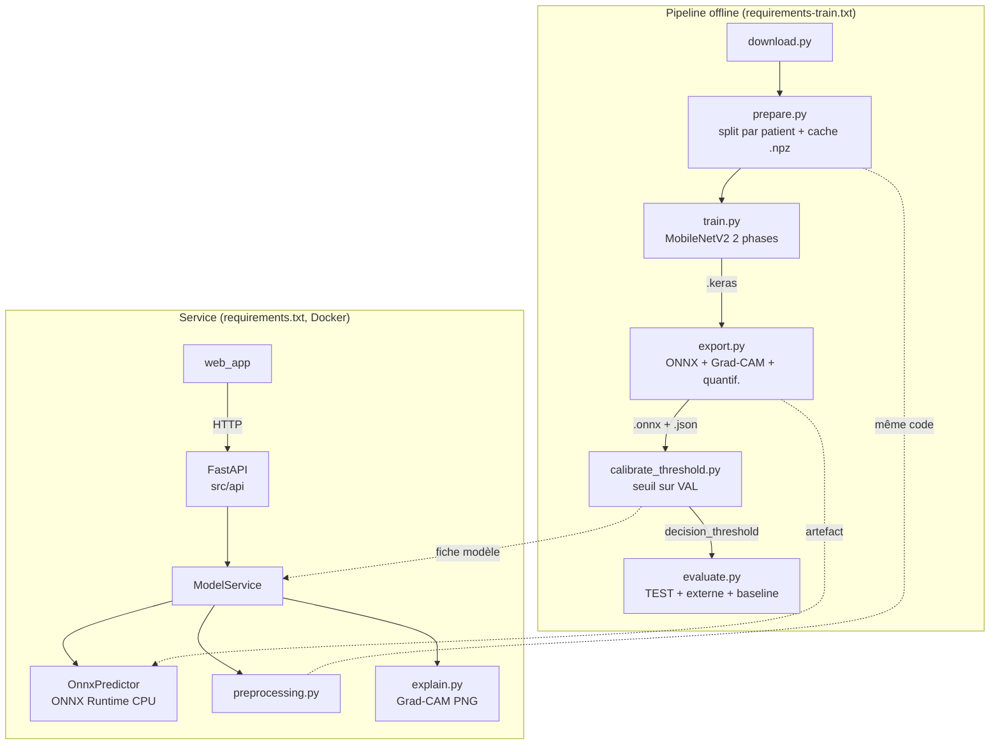
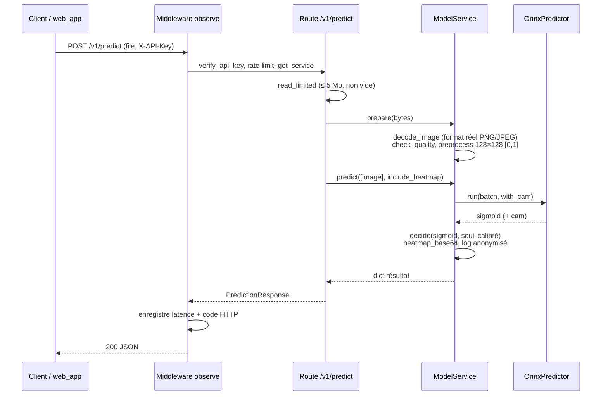

# Documentation technique PaluNet

Documentation de référence du code de PaluNet V1 (cahier des charges V3.1).
Elle s'adresse aux développeurs, ML engineers et opérateurs qui doivent comprendre, modifier,
entraîner, déployer ou auditer le système.

> ⚠️ PaluNet est un **outil d'aide à la décision**. Il ne remplace pas un diagnostic médical
> certifié. La V1 est une version de démonstration : production gelée jusqu'à validation clinique.

## Sommaire

| Document | Contenu |
| --- | --- |
| [README.md](README.md) (ce fichier) | Vue d'ensemble, architecture, flux de bout en bout, conventions |
| [configuration.md](configuration.md) | `config/config.yaml`, `src/config.py`, variables d'environnement |
| [pipeline-donnees.md](pipeline-donnees.md) | Téléchargement, split par patient, prétraitement, cache `.npz` |
| [modele.md](modele.md) | Architecture, entraînement, export ONNX, Grad-CAM, calibration, évaluation, métriques |
| [api.md](api.md) | Application FastAPI : routes, contrat, service, sécurité, observabilité |
| [interface-web.md](interface-web.md) | Interface de démonstration HTML/JS |
| [tests-qualite.md](tests-qualite.md) | Stratégie de test, fixtures, couverture, test de charge |
| [deploiement-exploitation.md](deploiement-exploitation.md) | Docker, CI/CD, journaux, suivi de dérive, dépannage |
| [points-attention.md](points-attention.md) | Limites connues, risques et pistes d'amélioration |

Documents existants complémentaires :
[gouvernance-donnees.md](../gouvernance-donnees.md) (loi 2013-450, anonymisation) et
[plan-derive.md](../plan-derive.md) (audit mensuel E5).

---

## 1. Objectif du système

PaluNet classe l'image d'une **cellule sanguine unique** (frottis mince, coloration Giemsa) en
deux classes :

- `Parasitized` : cellule infectée par *Plasmodium* (classe **positive**) ;
- `Uninfected` : cellule saine.

Le modèle est un **MobileNetV2** pré-entraîné sur ImageNet, adapté par transfer learning.
Il est exporté en **ONNX** et servi par une **API FastAPI** sur CPU, sans TensorFlow.
Une interface web montre le résultat et, en option, une carte **Grad-CAM** des zones qui ont
motivé la décision.

La métrique prioritaire est le **rappel** de la classe positive. Un faux négatif (cellule
infectée déclarée saine) coûte plus cher qu'un faux positif. Le seuil de décision est donc
calibré pour garantir un rappel ≥ 98 % sur la validation, et n'est jamais fixé à 0,5 par défaut.

## 2. Arborescence

```
Palunet/
├── config/config.yaml          Source unique de vérité : hyperparamètres, class_map, version
├── src/
│   ├── config.py               Chargement de la config, encodage de classe (B9)
│   ├── utils/logger.py         Logs JSON, journal de prédictions anonymisé
│   ├── data/                   Pipeline de données (offline)
│   │   ├── download.py         A1 — récupération du dataset NIH
│   │   ├── split.py            A4 — split stratifié par patient
│   │   ├── preprocessing.py    A2 — prétraitement partagé entraînement / API
│   │   └── prepare.py          Construction des splits et du cache .npz
│   ├── models/                 Modèle (offline + inférence)
│   │   ├── model.py            Architecture Keras + modèle d'inférence Grad-CAM
│   │   ├── train.py            B1–B4 — entraînement en 2 phases
│   │   ├── export.py           B5 — export ONNX + quantification
│   │   ├── calibrate_threshold.py  B6 — calibration du seuil
│   │   ├── evaluate.py         B7/E4/E5 — évaluation, baseline, audit de dérive
│   │   ├── inference.py        Moteur ONNX Runtime, mock, règle de décision
│   │   ├── explain.py          Rendu de la carte Grad-CAM
│   │   ├── metrics.py          Métriques numpy pur (AUC, seuil…)
│   │   └── artifacts.py        Chemins et fiche modèle versionnés (B8)
│   └── api/                    API d'inférence (module C)
│       ├── main.py             Fabrique d'application, middleware, métriques
│       ├── settings.py         Configuration par variables d'environnement
│       ├── dependencies.py     Auth clé API, rate limiting, injection du service
│       ├── service.py          ModelService : chargement, validation, prédiction, logs
│       ├── schemas.py          Contrat Pydantic (figé, /v1)
│       └── routes/             health.py, predict.py
├── web_app/                    Interface de démonstration (index.html, app.js, styles.css)
├── tests/                      unit/, integration/, model/, load/
├── data/                       raw/, processed/, external/ (hors Git)
├── models/                     Artefacts ONNX + fiches JSON (hors Git)
├── metrics_baseline/           Baselines de non-régression (versionnées)
├── logs/                       Logs d'entraînement et de prédiction (hors Git)
├── Dockerfile, docker-compose.yml, .github/workflows/ci-cd.yml
└── requirements*.txt, pyproject.toml
```

## 3. Architecture

Le projet comporte deux mondes séparés par un artefact versionné :

1. **Pipeline offline** (TensorFlow) : données, entraînement, export, calibration, évaluation.
2. **Service en ligne** (sans TensorFlow) : API FastAPI + ONNX Runtime + interface web.

Le seul lien entre les deux est le couple `models/model_v<version>.onnx` +
`models/model_v<version>.json` (fiche modèle). Le code de prétraitement
`src/data/preprocessing.py` est partagé : il n'importe pas TensorFlow.



### Dépendances entre modules

| Module | Importé par |
| --- | --- |
| `src/config.py` | `split`, `inference`, `settings`, `service`, `prepare`, `download`, `train`, `export`, `calibrate_threshold`, `evaluate` |
| `src/utils/logger.py` | `main`, `service`, tous les scripts CLI |
| `data/preprocessing.py` | `prepare`, `evaluate`, `service` |
| `data/split.py` | `prepare`, `evaluate` |
| `models/artifacts.py` | `settings`, `service`, `train`, `export`, `calibrate_threshold`, `evaluate` |
| `models/metrics.py` | `train`, `calibrate_threshold`, `evaluate` |
| `models/inference.py` | `service`, `export`, `calibrate_threshold`, `evaluate` |
| `models/explain.py` | `service` |
| `models/model.py` | `train`, `export` |
| `api/settings.py` | `service`, `dependencies`, `main` |
| `api/service.py` | `dependencies`, `routes/predict`, `main` |

Règle de conception : tout ce qui tourne dans l'API (`config`, `preprocessing`, `inference`,
`explain`, `metrics`, `artifacts`, `api/*`) n'importe ni TensorFlow ni scikit-learn.
L'image Docker reste ainsi légère.

## 4. Flux de bout en bout

### 4.1 Entraînement (une fois par version de modèle)

```bash
python -m src.data.download --source "Malaria Cell Images Dataset.zip"
python -m src.data.prepare
python -m src.models.train
python -m src.models.export
python -m src.models.calibrate_threshold
python -m src.models.evaluate --write-baseline
```

| Étape | Entrée | Sortie |
| --- | --- | --- |
| download | URL NIH, archive ou dossier | `data/raw/cell_images/{Parasitized,Uninfected}/*.png` |
| prepare | images brutes | `data/processed/{train,val,test,external}.npz`, `manifest.csv`, `split_summary.json` |
| train | `train.npz`, `val.npz` | `models/keras/model_v<v>.keras`, `logs/training_v<v>_phase{1,2}.csv`, `logs/experiments.csv` |
| export | `.keras`, `val.npz` (vérification) | `models/model_v<v>.onnx`, `models/model_v<v>.json` (seuil = `null`) |
| calibrate_threshold | `.onnx`, `val.npz` | `decision_threshold` et `calibration` écrits dans la fiche JSON |
| evaluate | `.onnx`, fiche, `test.npz`, `external.npz` | métriques JSON, `metrics_baseline/<v>.json` |

### 4.2 Prédiction (requête API)



## 5. Conventions transverses

- **Codes d'exigence.** Les docstrings citent les exigences du cahier des charges : A (données),
  B (modèle), C (API), D (interface), E (qualité / exploitation). Exemple : `B6` = calibration du
  seuil. Voir [`cdc-optimisé-détection-automatique-du-paludisme.md`](../../cdc-optimisé-détection-automatique-du-paludisme.md).
- **Encodage de classe figé (B9).** `class_map = {0: Uninfected, 1: Parasitized}`. La sortie
  sigmoïde vaut P(classe d'indice 1). Seule `positive_probability()` interprète cette orientation.
- **Chemins.** Tout chemin relatif est résolu depuis la racine du projet (`resolve_path`), pas
  depuis le répertoire courant.
- **Versionnement (B8).** Version semver `X.Y.Z` dans `config.yaml` ; tous les artefacts
  portent la version dans leur nom (`ModelPaths`).
- **Exécution.** Les scripts se lancent comme modules depuis la racine :
  `python -m src.<paquet>.<module>`.
- **Langue.** Code en anglais, docstrings, logs et messages d'erreur en français.

## 6. Glossaire

| Terme | Définition |
| --- | --- |
| Rappel (recall, sensibilité) | TP / (TP + FN) : part des cellules parasitées détectées |
| Précision | TP / (TP + FP) : part des alertes qui sont de vrais positifs |
| Spécificité | TN / (TN + FP) : part des cellules saines reconnues |
| AUC | Aire sous la courbe ROC, indépendante du seuil |
| Seuil calibré | `decision_threshold` : probabilité minimale pour déclarer `Parasitized` |
| Fiche modèle | JSON à côté du `.onnx` : version, class_map, seuil, sha256, calibration |
| Baseline | `metrics_baseline/<version>.json` : métriques de référence pour la non-régression |
| Grad-CAM | Carte de chaleur des zones de l'image qui ont le plus pesé dans la décision |
| IQA | Image Quality Assessment : contrôle qualité minimal (taille, uniformité) |
| Mode mock | `MOCK_MODEL=true` : prédicteur factice pour développer sans modèle entraîné |
