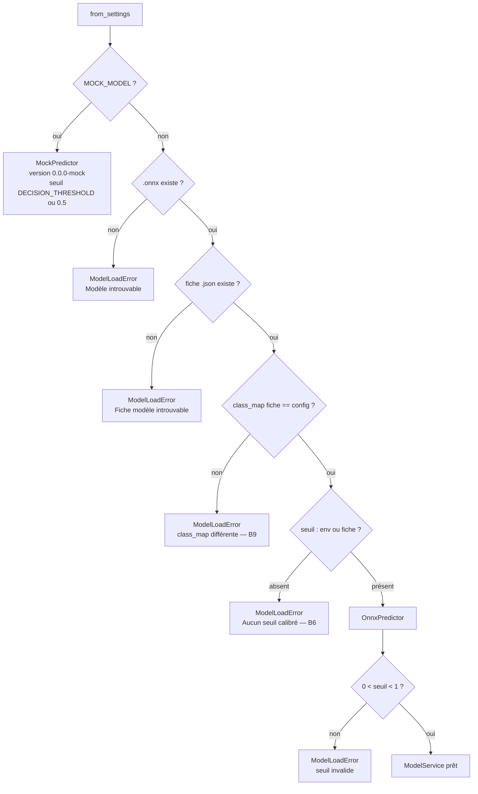

# API d'inférence (`src/api/`)

API FastAPI servie par Uvicorn. Elle charge un modèle ONNX versionné, valide les images reçues,
applique le seuil calibré et renvoie une prédiction, avec en option une carte Grad-CAM.
Elle ne dépend pas de TensorFlow.

```bash
uvicorn src.api.main:app --port 8000                     # modèle réel
MOCK_MODEL=true uvicorn src.api.main:app --port 8000     # sans modèle (développement)
```

- Interface de démonstration : `http://localhost:8000/`
- OpenAPI / Swagger : `http://localhost:8000/docs` (ReDoc : `/redoc`)

## 1. Organisation

| Fichier | Responsabilité |
| --- | --- |
| `main.py` | Fabrique `create_app()`, cycle de vie, middleware d'observation, `RequestMetrics`, montage des routes et de `web_app/` |
| `settings.py` | `Settings` : configuration par variables d'environnement (voir [configuration.md](configuration.md#3-variables-denvironnement-de-lapi)) |
| `dependencies.py` | Injection du service, authentification par clé API, clé de rate limiting, construction du `Limiter` |
| `service.py` | `ModelService` : chargement et contrôle du modèle, préparation des images, prédiction, journalisation |
| `schemas.py` | Modèles Pydantic du contrat `/v1` (figé) |
| `routes/health.py` | `/health`, `/health/live`, `/metrics` |
| `routes/predict.py` | `/v1/predict`, `/v1/predict/batch` |

## 2. Cycle de vie de l'application — `main.py`

`create_app(settings=None, service=None)` :

1. Lit `Settings.from_env()` si aucun `settings` n'est fourni.
2. Configure les logs JSON (`configure_logging`).
3. Crée l'application avec le titre, la version d'API `1.0.0` et l'avertissement médical comme
   description OpenAPI.
4. Stocke dans `app.state` : `settings`, `service` (éventuellement injecté par les tests),
   `metrics` (`RequestMetrics`), `limiter`.
5. Enregistre le gestionnaire `RateLimitExceeded` (réponse 429 de slowapi).
6. Ajoute le middleware CORS si `CORS_ORIGINS` est défini (méthodes `GET`, `POST` ; en-têtes
   `X-API-Key`, `Content-Type`).
7. Ajoute le middleware `observe` (latence, codes HTTP, filet de sécurité 500).
8. Monte les routeurs `health` et `predict`, puis `web_app/` en fichiers statiques sur `/`
   (`html=True` : `/` sert `index.html`).

Au démarrage (`lifespan`), si aucun service n'a été injecté :

- `ModelService.from_settings(settings)` charge le modèle ;
- en cas de `ModelLoadError`, l'instance **reste vivante** (`/health/live` = 200) mais **non
  prête** (`/health` = 503 avec le message d'erreur, routes `/v1/*` = 503). L'orchestrateur ne
  lui envoie donc pas de trafic ;
- si `API_KEY` est vide, un avertissement rappelle que l'authentification est désactivée.

Le module expose `app = create_app()` pour Uvicorn. Les tests appellent `create_app()` avec des
`Settings` et un service mock.

### Middleware `observe`

- Mesure la durée de chaque requête.
- Capture toute exception non gérée : log `Erreur interne` avec la trace, réponse
  `500 {"detail": "Erreur interne du serveur"}` sans détail technique pour le client.
- Enregistre code HTTP et latence dans `RequestMetrics`, **uniquement pour les chemins `/v1/*`**.

### `RequestMetrics`

Compteurs en mémoire, propres à chaque instance, protégés par un verrou :

- `latencies` : les 1 000 dernières latences (fenêtre glissante) ;
- `status_counts` : nombre de réponses par code HTTP depuis le démarrage.

`snapshot()` renvoie `requests_total`, `error_rate` (part des codes ≥ 400), `status_codes` et
les percentiles `p50`, `p95`, `p99` (méthode du rang le plus proche sur la fenêtre).

## 3. Service de prédiction — `service.py`

### `ModelService.from_settings(settings)`



Paramètres communs lus dans `config.yaml` : `class_map`, `positive_class`, `image_size`,
`min_side_px`, `min_std`.

### Méthodes

| Méthode | Rôle |
| --- | --- |
| `prepare(data: bytes) -> PreparedImage` | `decode_image` (format réel PNG/JPEG, détection de corruption), `check_quality`, `preprocess`. Lève `InvalidImageError` |
| `predict(images, include_heatmap=False, endpoint="predict") -> list[dict]` | Empile les images en **un seul batch**, une seule inférence ONNX, applique `decide()` à chaque image, génère la carte Grad-CAM si demandée et disponible, journalise chaque prédiction |
| `has_heatmap` | Vrai si le prédicteur expose une sortie `cam` |
| `health()` | Contenu de `/health` quand le service est prêt |
| `_log(result, endpoint)` | Journal de prédiction anonymisé (C5) |

`processing_time_ms` est le temps d'**inférence** du batch (même valeur pour toutes les images
d'un lot), pas la durée totale de la requête HTTP.

### Journal de prédictions anonymisé (C5)

Chaque prédiction produit un enregistrement sur le logger `palunet.predictions` :

```json
{"timestamp": "2026-10-05T10:12:03.120000+00:00", "level": "INFO",
 "logger": "palunet.predictions", "message": "prediction",
 "prediction_id": "3f1c…", "endpoint": "predict", "prediction": "Parasitized",
 "probability_parasitized": 0.9421, "decision_threshold": 0.3127,
 "model_version": "1.0.0", "processing_time_ms": 21, "quality_warnings": 0}
```

Ne sont **jamais** journalisés : le nom de fichier (les noms NIH contiennent l'identifiant
patient), l'image, l'adresse IP, la clé API. Ce point est vérifié par
`test_prediction_log_is_anonymised`.

## 4. Sécurité et quotas — `dependencies.py`

| Élément | Comportement |
| --- | --- |
| `get_settings(request)` | Renvoie `app.state.settings` |
| `get_service(request)` | Renvoie le service, ou `503 Modèle non chargé` |
| `verify_api_key` | Dépendance de **toutes** les routes `/v1/*`. Si `API_KEY` est vide : aucun contrôle. Sinon, compare l'en-tête `X-API-Key` à chaque clé autorisée en **temps constant** (`hmac.compare_digest`), sinon `401` |
| `rate_limit_key(request)` | Clé du quota : `key:<X-API-Key>` si l'en-tête est présent, sinon `ip:<adresse>` |
| `build_limiter(settings)` | `slowapi.Limiter` avec `RATE_LIMIT_STORAGE` |

Les routes de santé (`/health`, `/health/live`, `/metrics`) sont **publiques** : elles servent
aux sondes de l'orchestrateur.

Ordre des contrôles sur `/v1/*` : authentification (dépendance FastAPI) → quota (décorateur
slowapi) → service disponible → validation du fichier. Une clé invalide reçoit donc 401 sans
consommer de quota. Chaque **requête** compte pour 1 dans le quota, y compris un lot de 32 images.

## 5. Référence des routes

### `POST /v1/predict`

Requête `multipart/form-data` :

| Champ | Type | Obligatoire | Description |
| --- | --- | --- | --- |
| `file` | fichier | oui | Image PNG ou JPEG d'une cellule unique, ≤ 5 Mo |
| `include_heatmap` | bool | non | Renvoyer la carte Grad-CAM. Accepté en champ de formulaire **ou** en paramètre de requête `?include_heatmap=true` |

En-tête : `X-API-Key` si l'authentification est active.

```bash
curl -H "X-API-Key: $API_KEY" -F file=@cellule.png -F include_heatmap=true \
     http://localhost:8000/v1/predict
```

Réponse 200 (`PredictionResponse`) :

| Champ | Type | Description |
| --- | --- | --- |
| `prediction` | str | `Parasitized` ou `Uninfected` |
| `confidence` | float [0,1] | Probabilité de la classe **prédite** |
| `probability_parasitized` | float [0,1] | Probabilité d'infection, quelle que soit la prédiction |
| `model_version` | str | Version du modèle servi |
| `processing_time_ms` | int | Durée de l'inférence |
| `heatmap_base64` | str \| null | PNG RGBA 128 × 128 en base64 (si demandé et disponible) |
| `quality_warnings` | list[str] | Avertissements IQA ; la prédiction est quand même fournie |

```json
{
  "prediction": "Parasitized",
  "confidence": 0.9421,
  "probability_parasitized": 0.9421,
  "model_version": "1.0.0",
  "processing_time_ms": 21,
  "heatmap_base64": null,
  "quality_warnings": []
}
```

### `POST /v1/predict/batch`

| Champ | Type | Description |
| --- | --- | --- |
| `files` | fichiers (répété) | 1 à 32 images PNG/JPEG, ≤ 5 Mo chacune |

- Plus de `MAX_BATCH_SIZE` fichiers : **400** pour toute la requête.
- Un fichier invalide n'invalide **pas** le lot : il apparaît dans `errors` avec son code
  (400 ou 413) ; les autres sont prédits en une seule inférence.
- Pas de carte Grad-CAM en mode lot.
- Ici le nom de fichier est renvoyé au client (pour faire le lien), mais il n'est pas journalisé.

Réponse 200 (`BatchResponse`) :

```json
{
  "results": [
    {"filename": "a.png", "prediction": "Parasitized", "confidence": 0.97,
     "probability_parasitized": 0.97, "model_version": "1.0.0", "processing_time_ms": 35,
     "heatmap_base64": null, "quality_warnings": []}
  ],
  "errors": [
    {"filename": "broken.png", "status_code": 400, "detail": "Fichier image illisible ou corrompu"}
  ],
  "model_version": "1.0.0",
  "processing_time_ms": 41
}
```

Le `processing_time_ms` global inclut la lecture et la validation des fichiers.

### `GET /health` (readiness)

- 200 : `{"status": "ok", "model_version", "decision_threshold", "class_map", "heatmap_available"}`
- 503 : `{"status": "unavailable", "detail": "<raison du non-chargement>"}`

### `GET /health/live` (liveness)

Toujours `200 {"status": "alive"}` tant que le processus répond.

### `GET /metrics`

```json
{
  "requests_total": 120, "error_rate": 0.0083,
  "status_codes": {"200": 119, "400": 1},
  "latency_ms": {"p50": 18.2, "p95": 41.0, "p99": 77.5, "window": 120},
  "model_version": "1.0.0", "decision_threshold": 0.3127
}
```

Métriques **par instance**, remises à zéro au redémarrage. Format JSON, pas Prometheus.

### Codes d'erreur

| Code | Cause | Corps |
| --- | --- | --- |
| 400 | Format autre que PNG/JPEG, fichier corrompu ou tronqué, fichier vide, lot trop grand | `{"detail": "..."}` |
| 401 | `X-API-Key` absent ou invalide | `{"detail": "..."}` |
| 413 | Fichier > `MAX_UPLOAD_MB` | `{"detail": "Fichier trop volumineux (max 5 Mo)"}` |
| 422 | Champ `file` / `files` manquant (validation FastAPI) | `{"detail": [...]}` |
| 429 | Quota dépassé | `{"error": "Rate limit exceeded: ..."}` (format slowapi) |
| 503 | Modèle non chargé | `{"detail": "Modèle non chargé"}` |
| 500 | Erreur interne | `{"detail": "Erreur interne du serveur"}` |

La taille est contrôlée en lisant au plus `max_bytes + 1` octets : un fichier trop gros n'est
jamais chargé entièrement en mémoire.

## 6. Contrat et versionnement

Le contrat `/v1` défini dans `schemas.py` est **figé**. Ajouter un champ optionnel reste
compatible. Renommer, supprimer ou changer le sens d'un champ impose un nouveau préfixe `/v2`.
La version d'API (`API_VERSION = "1.0.0"`) est distincte de la version du modèle
(`model_version`).

## 7. Concurrence et performance

- Les routes sont des fonctions **synchrones** (`def`) : FastAPI les exécute dans son pool de
  threads, et l'inférence ONNX ne bloque pas la boucle d'événements.
- Une session ONNX Runtime unique est partagée entre les threads (son `run` est thread-safe).
- `INTRA_OP_THREADS` limite le parallélisme interne d'ONNX Runtime : l'aligner sur les vCPU
  évite la sur-souscription (Dockerfile : 2).
- Docker lance **un seul worker** Uvicorn. Pour monter en charge, multiplier les conteneurs et
  partager le quota via `RATE_LIMIT_STORAGE=redis://…`.
- SLO : P95 de `/v1/predict` < 500 ms sur 2 vCPU / 2 Go (vérifié par le test de charge Locust).
