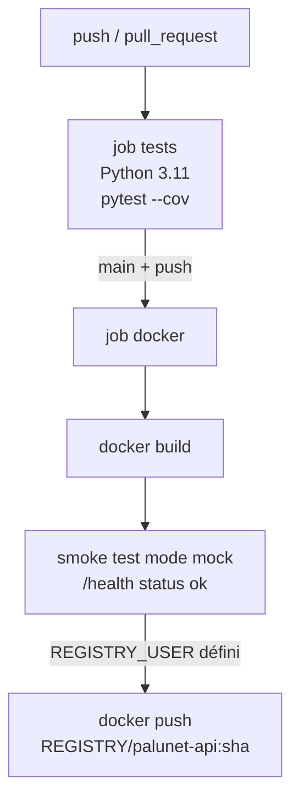

# Déploiement et exploitation

## 1. Environnements Python

Python **3.10 ou 3.11** obligatoire (`requires-python = ">=3.10,<3.12"`) : TensorFlow 2.15 ne
supporte pas les versions suivantes.

| Fichier | Contenu | Usage |
| --- | --- | --- |
| `requirements.txt` | FastAPI, Uvicorn, python-multipart, Pydantic, ONNX Runtime, numpy < 2, Pillow, PyYAML, slowapi | API / image Docker (sans TensorFlow) |
| `requirements-train.txt` | + TensorFlow 2.15.1, tf2onnx, onnx, protobuf, scikit-learn, matplotlib | Pipeline d'entraînement |
| `requirements-dev.txt` | + pytest, pytest-cov, httpx, Locust | Tests |

```bash
py -3.11 -m venv .venv
.venv\Scripts\activate                 # Windows ; Linux/macOS : source .venv/bin/activate
pip install -r requirements-train.txt -r requirements-dev.txt
```

## 2. Image Docker

[`Dockerfile`](../../Dockerfile) — image d'inférence `python:3.11-slim` :

1. Installe `requirements.txt` uniquement (image légère, sans TensorFlow).
2. Copie `config/`, `src/`, `web_app/` et `models/`. Le `.dockerignore` exclut données, tests,
   notebooks, `models/keras` et `models/checkpoints`.
3. Exécute le service sous un utilisateur non root `palunet` (UID 10001) ; seul `/app/logs` est
   accessible en écriture.
4. Variables par défaut : `PORT=8000`, `LOG_LEVEL=INFO`, `RATE_LIMIT=60/minute`, `INTRA_OP_THREADS=2`.
5. `HEALTHCHECK` toutes les 30 s sur `/health` (readiness : échoue tant que le modèle n'est pas chargé).
6. Lancement : `uvicorn src.api.main:app --host 0.0.0.0 --port $PORT --workers 1 --no-access-log`.
   Le journal d'accès Uvicorn est désactivé : il contiendrait les adresses IP.

**Le modèle doit être présent avant le build** (`models/model_v<v>.onnx` + `.json`), ou monté
en volume avec `MODEL_PATH`. Sinon le conteneur démarre mais reste non prêt (503).

### docker compose

```bash
cp .env.example .env          # puis définir API_KEY
docker compose up --build
```

[`docker-compose.yml`](../../docker-compose.yml) :

- `API_KEY` est **obligatoire** (`${API_KEY:?…}`) : le démarrage échoue sans clé ;
- `MODEL_PATH` par défaut : `models/model_v1.0.0.onnx` (à mettre à jour à chaque version) ;
- journal de prédictions dans `/app/logs/predictions.log`, monté sur `./logs`, 365 jours de rétention ;
- limites de ressources : 2 CPU, 2 Go (E6) ;
- `restart: unless-stopped`.

## 3. CI/CD — `.github/workflows/ci-cd.yml`



| Job | Déclencheur | Étapes |
| --- | --- | --- |
| `tests` | tout push et toute PR | Installation `requirements-dev.txt`, `pytest --cov` (seuil 70 %), rapport `coverage.xml` publié en artefact |
| `docker` | push sur `main`, après `tests` | Build taggé avec le SHA, démarrage en `MOCK_MODEL=true`, attente de `/health` (30 s max), vérification de `"status":"ok"`, push vers le registre si les secrets existent |

Secrets attendus : `REGISTRY`, `REGISTRY_USER`, `REGISTRY_PASSWORD`.

Le modèle n'est pas dans Git : l'image CI est testée en mode mock. Avant un vrai déploiement,
il faut récupérer l'artefact ONNX depuis un stockage d'artefacts (non encore automatisé).

## 4. Mise en production d'une nouvelle version de modèle

1. Exécuter le pipeline complet (voir [README.md](README.md#41-entraînement-une-fois-par-version-de-modèle)).
2. Vérifier les critères d'acceptation dans la sortie de `evaluate` (accuracy ≥ 0,95,
   recall ≥ 0,96, AUC ≥ 0,97) et le jeu externe.
3. Committer `metrics_baseline/<v>.json`.
4. Publier `model_v<v>.onnx` et `model_v<v>.json` dans le stockage d'artefacts. Contrôler le
   `sha256` de la fiche.
5. Déployer avec `MODEL_PATH=models/model_v<v>.onnx` ; vérifier `/health` (version, seuil).
6. Garder la version précédente disponible pour un retour arrière immédiat (changer `MODEL_PATH`).

## 5. Journaux

Tous les logs sont des **lignes JSON** sur stdout ([`src/utils/logger.py`](../../src/utils/logger.py)) :

| Champ | Contenu |
| --- | --- |
| `timestamp` | ISO 8601 UTC |
| `level`, `logger`, `message` | Standard |
| champs `extra` | Ajoutés tels quels (ex. `model_version`, `prediction_id`) |
| `exception` | Trace si l'enregistrement en porte une |

| Fonction | Rôle |
| --- | --- |
| `JsonFormatter` | Sérialise l'enregistrement et ses champs `extra` (hors attributs standard de `LogRecord`) |
| `configure_logging(level, prediction_log_file, retention_days)` | Remplace les handlers racine par un handler JSON sur stdout (force l'UTF-8 pour les consoles Windows). Si `prediction_log_file` est fourni, ajoute au logger `palunet.predictions` un `TimedRotatingFileHandler` (rotation à minuit UTC, `retention_days` fichiers conservés : purge automatique au-delà de 12 mois) |
| `get_logger(name)` | Logger nommé ; configure la journalisation par défaut si rien ne l'a encore fait (scripts CLI) |

Le journal des prédictions part **aussi** sur stdout (propagation vers la racine). Les
contraintes d'anonymisation sont décrites dans [api.md](api.md#journal-de-prédictions-anonymisé-c5)
et [gouvernance-donnees.md](../gouvernance-donnees.md).

## 6. Supervision

| Sonde | Usage |
| --- | --- |
| `GET /health/live` | Liveness : redémarrer le conteneur si elle échoue |
| `GET /health` | Readiness : n'envoyer du trafic que si 200 |
| `GET /metrics` | Latences p50/p95/p99, taux d'erreur, codes HTTP, version, seuil (par instance) |

Alertes conseillées : P95 > 500 ms, `error_rate` en hausse (attention : il inclut les 4xx
client), `/health` en 503, changement inattendu de `model_version` ou de `decision_threshold`.

## 7. Suivi de la dérive (E5)

Procédure détaillée dans [plan-derive.md](../plan-derive.md). En résumé :

```bash
python -m src.models.evaluate --images-dir audit/2026-10
```

Code de sortie `2` si le rappel est inférieur à 94 % : déclencher le réentraînement. Entre 94 %
et 96 % : surveillance renforcée.

## 8. Dépannage

| Symptôme | Cause probable | Action |
| --- | --- | --- |
| `/health` 503 « Modèle introuvable » | `MODEL_PATH` erroné ou modèle non copié dans l'image | Vérifier `models/` ou monter le volume |
| `/health` 503 « Fiche modèle introuvable » | `.json` absent à côté du `.onnx` | Copier la fiche (même nom de base) |
| `/health` 503 « Aucun seuil calibré » | Calibration non lancée | `python -m src.models.calibrate_threshold` ou `DECISION_THRESHOLD` |
| `/health` 503 « class_map du modèle … != config » | Modèle entraîné avec un autre encodage | Utiliser le bon modèle ou la config correspondante, **ne pas** forcer |
| Le conteneur s'arrête au démarrage | Fichier ONNX corrompu (erreur ONNX Runtime, pas `ModelLoadError`) | Vérifier le `sha256` de la fiche |
| 401 sur toutes les requêtes | `X-API-Key` absent ou différent de `API_KEY` | Vérifier la clé (plusieurs clés séparées par des virgules) |
| 429 fréquents | Quota par clé atteint ou partagé derrière un proxy (quota par IP) | Relever `RATE_LIMIT`, une clé par client, Redis pour plusieurs instances |
| Quota incohérent entre instances | Stockage `memory://` par instance | `RATE_LIMIT_STORAGE=redis://…` |
| Latence élevée | Sur-souscription CPU | `INTRA_OP_THREADS` = nombre de vCPU |
| `pip install` échoue sur TensorFlow | Python ≥ 3.12 | Utiliser Python 3.10 ou 3.11 |
| Caractères illisibles dans la console Windows | Encodage cp1252 | Les logs forcent l'UTF-8 ; utiliser Windows Terminal |
| `prepare` : « Aucune image trouvée » | Dataset non téléchargé | `python -m src.data.download` |
