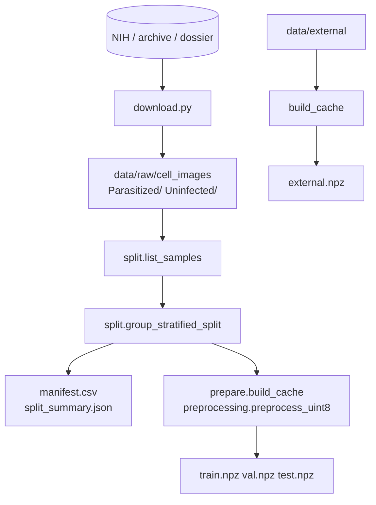

# Pipeline de données (`src/data/`)

Le pipeline transforme le dataset NIH brut en jeux `train` / `val` / `test` (+ `external`)
prétraités et mis en cache. Il garantit deux propriétés :

- **Aucune fuite de patient** entre les splits (A4).
- **Prétraitement identique** entre l'entraînement et l'API (A2).



## 1. Dataset source

- Dataset **NIH Malaria Cell Images** : environ 27 558 images PNG de cellules segmentées,
  équilibrées entre `Parasitized` et `Uninfected`, issues d'environ 200 patients.
- Les noms de fichiers encodent le patient, par exemple
  `C100P61ThinF_IMG_20150918_144104_cell_162.png` → patient `C100P61ThinF`.
- Le fond des images NIH est **noir**. Le prétraitement en tient compte (composition des images
  transparentes sur fond noir).

Les fichiers `patientid_cellmapping_*.csv` à la racine ne sont pas utilisés par le code :
l'identifiant patient est déduit du nom de fichier.

## 2. `download.py` — récupération (A1)

```bash
python -m src.data.download                                   # téléchargement NIH
python -m src.data.download --source "Malaria Cell Images Dataset.zip"
python -m src.data.download --source "Malaria Cell Images Dataset/"
python -m src.data.download --dest autre/dossier
```

| Fonction | Rôle |
| --- | --- |
| `find_class_root(base)` | Parcourt `base` et ses sous-dossiers, **du moins profond au plus profond**, et renvoie le premier qui contient à la fois `Parasitized/` et `Uninfected/`. Ignore ainsi le doublon imbriqué des archives Kaggle (`cell_images/cell_images`). `FileNotFoundError` sinon |
| `copy_dataset(src_root, dest)` | Copie les `.png` de chaque classe vers `dest/<classe>/`. N'écrase pas un fichier existant (relance idempotente). Renvoie le nombre d'images par classe |
| `download(url, target)` | Téléchargement HTTP en flux (`urllib`) |
| `main()` | Orchestration : téléchargement éventuel → extraction ZIP dans un dossier temporaire → copie normalisée |

Les fichiers temporaires (archive téléchargée, extraction) sont supprimés à la fin
(`tempfile.TemporaryDirectory`). Seuls les `.png` sont copiés (les `Thumbs.db` et autres sont ignorés).

## 3. `split.py` — split stratifié par patient (A4)

### Pourquoi par patient

Un patient fournit de nombreuses cellules très semblables. Un split au niveau image placerait le
même patient dans le train et le test. Le modèle « reconnaîtrait » alors le patient, et les
métriques seraient surestimées. Le split répartit donc des **patients entiers**.

### `Sample`

Dataclass gelée : `path` (str), `label` (int selon `class_map`), `patient_id` (str), `split`
(`""`, `train`, `val`, `test` ou `external`).

### Fonctions

| Fonction | Rôle |
| --- | --- |
| `patient_id_from_filename(name)` | Préfixe avant `_IMG` ; à défaut, tout ce qui précède le dernier `_` (utile pour les lots du jeu externe `lab<lot>_<n>.png`) |
| `list_samples(root, class_map)` | Liste triée des `*.png` de `root/<classe>/` pour chaque classe de `class_map` |
| `group_stratified_split(samples, fractions, seed)` | Affectation des patients aux splits (voir algorithme) |
| `write_manifest(samples, path, root)` | CSV `path,label,patient_id,split`, chemins relatifs à `root` en notation POSIX |
| `read_manifest(path, root)` | Lecture inverse ; les chemins relatifs sont résolus depuis `root` |
| `split_summary(samples)` | Par split : nombre d'images, de patients, d'images par label |

### Algorithme de `group_stratified_split`

1. Vérifie que les fractions somment à 1 (tolérance 1e-6), sinon `ValueError`.
2. Compte les images de chaque patient par classe : vecteur `counts[p] = [n_label0, n_label1]`.
3. Mélange les patients avec `numpy.random.default_rng(seed)`, puis les **trie par nombre
   d'images décroissant** (tri stable : à taille égale, l'ordre aléatoire est conservé). Placer les
   gros patients en premier améliore l'équilibre de l'algorithme glouton.
4. Calcule la cible `target[split, classe] = fraction(split) × total(classe)`.
5. Pour chaque patient, dans cet ordre :
   - déficit relatif `(target − current) / max(target, 1)` par split et par classe ;
   - score d'un split = Σ_classes `déficit × counts[p]` ;
   - le patient va dans le split au score maximal ; `current` est mis à jour.
6. Renvoie de nouveaux `Sample` avec le champ `split` renseigné.

Propriétés garanties (et testées dans `tests/unit/test_split.py`) :

- un patient n'apparaît que dans un seul split ;
- résultat **déterministe** pour une graine donnée, différent pour une autre graine ;
- proportions et équilibre des classes proches des cibles.

## 4. `preprocessing.py` — prétraitement partagé (A2)

Module **sans TensorFlow**, importé par l'API et par le pipeline. Toute modification change le
comportement du modèle déployé : elle est couverte par des tests de valeurs de référence
(`test_preprocessing_reference_values_are_stable`).

### Contrat d'entrée du modèle

| Propriété | Valeur |
| --- | --- |
| Espace couleur | RGB (transparence composée sur fond noir) |
| Taille | `image_size × image_size` (128 × 128), redimensionnement **bilinéaire** sans conserver le ratio |
| Type | `float32` |
| Plage | `[0, 1]` (division par 255) |
| Forme du batch | `(N, 128, 128, 3)` (NHWC) |

La mise à l'échelle `[-1, 1]` propre à MobileNetV2 est une **couche du modèle**
(`to_mobilenet_range`). Elle est donc embarquée dans l'ONNX : l'API n'a pas à la connaître.

### API du module

| Élément | Rôle |
| --- | --- |
| `ALLOWED_FORMATS` | `{"PNG", "JPEG"}` |
| `InvalidImageError(ValueError)` | Image illisible, corrompue ou de format refusé. Convertie en HTTP 400 par l'API |
| `QualityReport(ok, issues)` | Résultat du contrôle qualité |
| `decode_image(data, allowed_formats)` | Octets → image PIL RGB. Détecte le **format réel** (en-tête du fichier, pas l'extension), appelle `verify()` pour détecter les fichiers tronqués, puis recharge l'image (PIL interdit de réutiliser une image après `verify()`) |
| `load_image_file(path)` | Lecture disque + `decode_image` |
| `to_rgb(img)` | Images `RGBA`, `LA` ou `P` avec transparence : composition alpha sur fond noir opaque. Autres modes (L, CMYK…) : `convert("RGB")` |
| `preprocess(img, size)` | Image → `float32 (size, size, 3)` dans `[0, 1]`. Utilisé par l'API |
| `preprocess_uint8(img, size)` | Même redimensionnement, stocké en `uint8`. Utilisé pour le cache (4× moins de mémoire) |
| `uint8_to_model_input(arr)` | `uint8 → float32 / 255`. Garantit `uint8_to_model_input(preprocess_uint8(x)) == preprocess(x)` |
| `check_quality(img, min_side, min_std)` | IQA minimal : plus petit côté < `min_side` → « Image trop petite » ; écart-type des niveaux de gris < `min_std` → « Image quasi uniforme ». N'empêche **pas** la prédiction : les messages sont renvoyés dans `quality_warnings` |

> Point important : `train.py` et `OnnxPredictor.predict_uint8` refont la division par 255 sur le
> cache `uint8`. Le test `test_training_cache_matches_inference_preprocessing` vérifie que ce
> chemin donne exactement le même tenseur que `preprocess` dans l'API.

## 5. `prepare.py` — construction du cache

```bash
python -m src.data.prepare [--raw-dir data/raw/cell_images] [--out-dir data/processed]
```

Étapes de `main()` :

1. `list_samples` sur `raw_dir`. Sans image : arrêt avec un message qui renvoie vers `download`.
2. `group_stratified_split` avec `data.split` et `seed`.
3. Écriture de `manifest.csv` (traçabilité image → patient → split).
4. Pour chaque split, `build_cache` : décodage + `preprocess_uint8`, puis `np.savez(x, y)`.
   - `x` : `uint8 (N, 128, 128, 3)` ; `y` : `int64 (N,)` selon `class_map`.
   - Une image illisible est **ignorée** et comptée (`skipped`), avec un avertissement.
5. Jeu externe : si `data/external/Parasitized/` et `data/external/Uninfected/` existent,
   construction de `external.npz`. Avertissement si moins de 200 images (exigence A6), ou si le
   jeu est absent.
6. Écriture de `split_summary.json`.

### Fichiers produits (`data/processed/`, hors Git)

| Fichier | Contenu |
| --- | --- |
| `manifest.csv` | `path,label,patient_id,split` pour chaque image |
| `train.npz`, `val.npz`, `test.npz` | Clés `x` (uint8) et `y` (int64) |
| `external.npz` | Jeu externe, si présent |
| `split_summary.json` | Par split : `images`, `patients`, `label_0`, `label_1`, `skipped` (+ `external`) |

Mémoire : le cache complet tient en environ 1,4 Go (27 558 × 128 × 128 × 3 octets). Il est
chargé entièrement en RAM par `train.py`.
